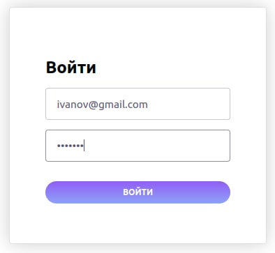
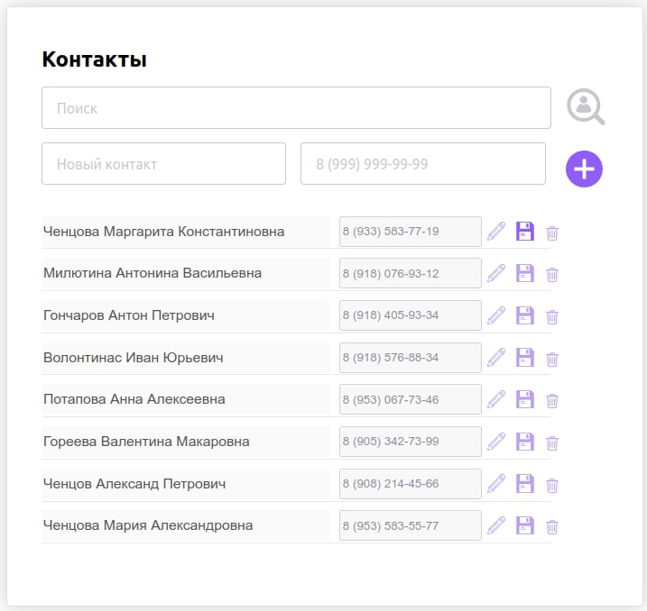

# Вход в личный кабинет и поиск/редактирование контактов
React, Redux, Typescript, css modules.

В приложении две страницы:
  -Страница входа
  -Страница со списком контактов. 

Страница со списком контактов пользователя доступна только после авторизации.
На странице со списком контактов есть возможность добавлять/удалять/редактировать контакты, а также функция поиска.

Для реализации авторизации и загрузки первичного списка контактов использованы запросы с моковыми данными https://github.com/typicode/json-server.

Для маски номера телефона использован плагин text-mask: https://github.com/text-mask/text-mask/tree/master/react, https://github.com/DefinitelyTyped/DefinitelyTyped/blob/master/types/react-text-mask/index.d.ts#L11.

Страница входа:

Страница контактов:

## Данные для входа в личный кабинет
"users": [
    {
      "email": "ivanov@gmail.com",
      "password": "123"
    },
    {
      "email": "petrov@yandex.ru",
      "password": "123456"
    },
    {
      "email": "sidorov@mail.ru",
      "password": "654321"
    }
  ]

node version: v16.13.1 

## Развертывание проекта
+ Клонирование репозитория:

  `git clone git@github.com:Malluma/personal_account.git`
+ Установка зависимостей:

  `npm install`
+ Запуск проекта:

  `npm run dev` (запуск json-server и самого проекта)
